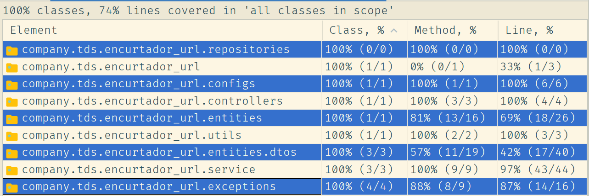

# Encurtador de Links

Este software é uma **API** para encurtar links (como o [bit.ly](https://bitly.com/) ou
o [tiny url](https://tinyurl.com/app)). Foi feito como um desafio e teve um período limitado de
tempo para desenvolvimento. Ao invés de investir em funcionalidades, dei prioridade para implementar
alguns recursos úteis, de modo a demonstrar conhecimento técnico.

Ainda assim, os campos extras do banco de dados foram mantidos, para uma possível implementação a
curto prazo.

## Documentação

A documentação do programa é feita pelo Swagger.  
Ao executar a aplicação, o caminho **swagger-ui/index.html** encaminhará para a versão
web. [Você pode clicar aqui se estiver executando localmente](http://localhost:8080/swagger-ui/index.html)
_ou_ importar [esse arquivo](doc/api-docs.json)
(doc/api-docs.json) [neste site](https://editor.swagger.io/#).

### Guia rápido:

> POST /url {"url":"string"}  
> GET /url/{shortUrl}

## Cobertura de testes

> Os testes dos endpoints (Controllers) foram feitos como integração.

A lógica da organização dos arquivos de teste foi: **Uma pasta para cada classe** e uma **classe
para cada método** ao invés de classes aninhadas (@Nested). O objetivo é um código bem mais legível,
mesmo que algumas duplicações ocorram.

## Escopo técnico

De forma intencional, como pedido pelo desafio, foi utilizado o mínimo de bibliotecas
complementares. Sendo assim, optei por não usar o [Lombok](https://projectlombok.org/)
, [Model Mapper](http://modelmapper.org/) e [SLF4J](http://www.slf4j.org/).

Devido ao pequeno escopo e classes também muito pequenas, também não foi necessário _até o momento_
utilizar o padrão factory (nem Builders) para testes, paginação de resultados nem o GitFlow.

## Endereço na nuvem

> [http://ec2-54-207-134-144.sa-east-1.compute.amazonaws.com](http://ec2-54-207-134-144.sa-east-1.compute.amazonaws.com/swagger-ui/index.html)
